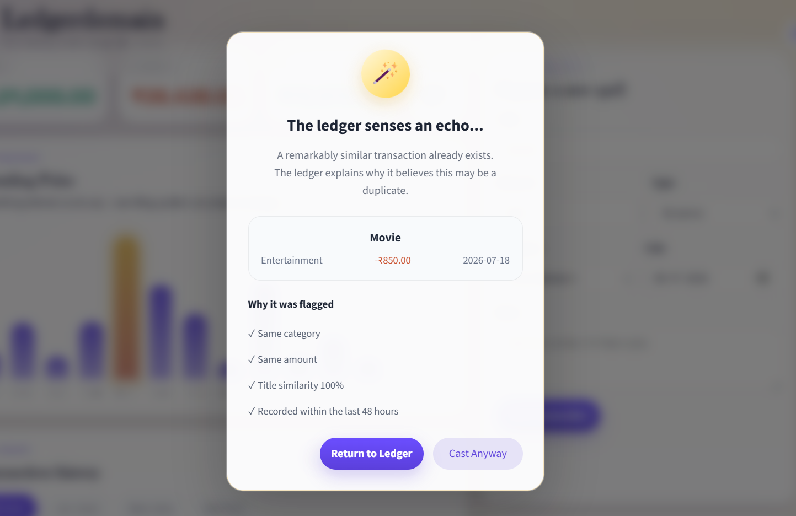

# Ledgerdemain- Your money made magically simple

*Built for Bytex's "Smart Mini-Ledger" take-home challenge.*

Ledgerdemain is a lightweight full-stack mini-ledger. It lets users add, edit, delete, categorize, and review income/expense transactions, while surfacing smart warnings when the ledger notices unusual financial patterns.

The name is a small wordplay on "legerdemain," meaning sleight of hand. I turned it into **Ledgerdemain** to connect the idea of a financial ledger with the feeling of making money management feel a little more effortless — even a little magical.

The product direction is intentionally memorable: a clean financial ledger with a subtle magical language system. The theme isn't just visual polish — it maps to actual product behavior. Warnings are "omens." Delete is a reversible "vanish" action, not a hard remove. Smart alerts are designed to read as signal, not noise.

## Preview

### Dashboard


### Dashboard Analytics

 (screenshots/ Ledgerdemain_ dashboard 2.png)

### Duplicate Detection

 ()

### Email Notification


## Challenge Coverage

Ledgerdemain covers the required assignment scope:

- Users can add, view, edit, and delete transactions.
- Transactions support income/expense type, category, notes, date, and amount.
- The dashboard shows income, expense, net balance, entry count, and category breakdown.
- Internal notifications appear in the bell panel and as right-side live toast alerts.
- Email notifications are supported through EmailJS for important events.
- This README documents AI usage, AI shortcomings, and human engineering decisions.

## Unique Twist

The core twist is a transparent, rule-based smart-alert layer, paired with a single-story anomaly visualization and reversible event-backed deletes. Three things work together here, not one:

- **Spending Pulse.** A custom bar visualization highlights the single strongest spending anomaly for the selected month, computed against a real mean + standard-deviation threshold — not just "the tallest bar." It deliberately avoids noisy multi-highlight charts in favor of one clear story: *"something changed here, and here's how unusual it was."*

- **Transparent duplicate detection.** Rather than silently flagging a transaction as a possible duplicate, Ledgerdemain shows its reasoning: same category, same amount, title similarity percentage, and time window, all listed explicitly in a confirmation modal before the user commits. The goal was to avoid a black-box warning — the user can see exactly why something was flagged and decide for themselves whether to proceed.

- **Event-backed undo delete.** Deletes are not hard-removes. A `ledger_events` log stores deleted transaction payloads, so the UI's "Poof... Undo?" interaction reflects a real reversible architecture rather than a cosmetic animation layered on top of a permanent delete.

- **Notification tone as product design.** Alerts use consistent "Warnings & Omens" language across the in-app panel, live toast notifications, and email — including a rule that groups multiple warning signals on the same transaction into a single combined email instead of sending several separate alerts.

## Production Polish

- Structured Flask services for ledger operations, rule analysis, notifications, and persistence.
- SQLite schema initialization and safe column migration helpers.
- Input validation for title, amount, type, category, and future dates.
- Dynamic category options based on income/expense type.
- Paginated transaction history, 10 entries per page.
- Loading shimmer, empty state copy, live notifications, undo toast, and delete animation.
- Auto-seeded sample data on a fresh database so reviewers immediately see a populated dashboard.
- EmailJS integration for browser-based email delivery over HTTPS.
- Clear separation between routine in-app activity and important email-worthy warnings.


## Tech Stack

**Backend**
- Flask
- SQLite
- Flask-CORS

**Frontend**
- React
- Vite
- Custom CSS


## Project Structure

```text
backend/
  app/
    db.py
    routes.py
    services/
      ledger.py
      notifications.py
      rules.py
frontend/
  src/
    App.jsx
    styles.css
```

## Notification and Email Events

Ledgerdemain avoids noisy emails. Routine edits, deletes, restores, and demo-data creation stay in-app only. Email is reserved for events that deserve attention:

- **Welcome email** — sent when a notification email is saved for the first time.
- **Email changed confirmation** — sent when the notification email is changed.
- **Possible duplicate detected** — sent when a new transaction looks similar to an existing one.
- **Unusual spending spike** — sent when an expense is at least 2x the recent expense average.
- **Weekly cashflow turned negative** — sent when the last 7 days show more expense than income.

If one transaction triggers multiple warning rules, Ledgerdemain sends a single combined alert email with all reasons grouped together. The in-app notification panel can still show each signal separately.


## AI Usage

This project was built with AI assistance across two different roles: one tool for generation, one for critique.

## AI Tools Used

- **Codex** — used for initial boilerplate: Flask/React scaffolding, CRUD route shapes, form state, and repetitive UI code (summary cards, table rendering, fetch handlers).
- **Claude** — used as an AI critique partner throughout the build: reviewing UI screenshots and flagging usability issues, pressure-testing feature ideas for originality, debugging deployment failures, and refining copy/microcopy for consistency.

## How AI Accelerated the Work

- Codex generated the first working Flask/React structure quickly, saving significant setup time on CRUD boilerplate.
- Claude reviewed each UI iteration against real screenshots and caught specific issues that would otherwise have gone unnoticed until a reviewer found them — for example, a Category/Type mismatch in the transaction form, inconsistent visual hierarchy in confirmation modals, and an anomaly chart that was highlighting multiple bars when its own caption only described one.
- Claude helped pressure-test the "unique twist" concept itself — the first idea (a simple recurring-transaction toggle) was flagged as too generic and commonly implemented elsewhere, which led to building transparent, multi-signal duplicate detection instead.

## Where AI Fell Short

- **Codex wrote a function that was never called.** `sendAlertEmails()` was fully implemented and logically correct, but no code path in the app ever invoked it — so no email notification fired regardless of configuration, with no error surfaced to explain why. This was only caught by manually tracing every call site in the codebase.
- **Codex's initial anomaly-highlighting logic styled every "tall-looking" bar** instead of computing an actual statistical threshold, which directly contradicted the chart's own caption (which described a single spike). Fixed by implementing a real mean + standard-deviation threshold so exactly one true anomaly is flagged, matching the copy.
- **A deployment assumption didn't hold in production.** SMTP-based email worked correctly on localhost but was silently blocked by the hosting provider's outbound port restrictions once deployed — a failure mode that never appeared during local testing. Resolved by switching the delivery path to EmailJS, which sends over HTTPS instead of SMTP.
- Claude, used purely as a critique tool, can flag things like "this function looks unused" or "this button hierarchy is backwards," but can't verify runtime behavior on its own — confirming and fixing each issue still required me to actually run, test, and trace the app manually.

## Human Engineering Judgment

- Traced and fixed the unused `sendAlertEmails()` call, then added explicit console warnings so future configuration failures fail loudly instead of silently.
- Diagnosed the SMTP-vs-hosting-provider port-blocking issue and migrated the email delivery path to EmailJS.
- Designed the duplicate-detection modal to show its reasoning explicitly (category match, amount match, title similarity percentage, time window) rather than presenting a black-box flag.
- Reworked the anomaly chart so only one true statistical outlier is highlighted, keeping the insight legible instead of visually diluted.
- Deliberately scoped out authentication, a generic recurring-transaction toggle, and multi-page navigation — each was considered and cut to keep the twist focused and avoid shipping half-finished features under time pressure.
- Chose Flask over a heavier backend framework because this is a mini-ledger, and Flask keeps the code easy to read and inspect in a review context.
- Added a dedicated rule engine instead of burying alert logic inside route handlers, so notification rules stay in one place and are easy to extend.

## Future Improvements

- User authentication and per-user ledgers.
- Budget limits per category.
- CSV/PDF export.
- Scheduled monthly digest emails.
- Backend-owned email templates if a future production deployment uses a dedicated transactional email API.